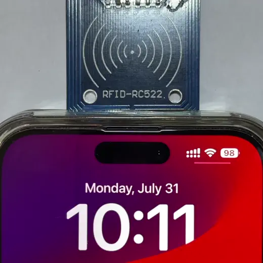
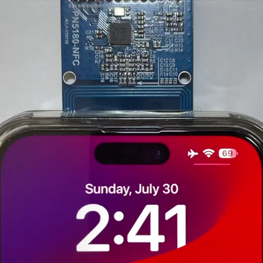
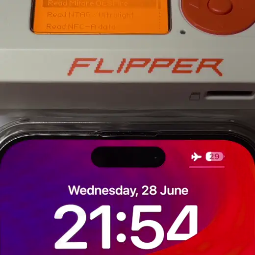

# Chips

This document describes chips and modules that ECP can be unofficially implemented on.  
It also describes common issues that could occur with those chips and ways to overcome them.  
This document may or may not mention original developers of particular hardware. I am in no way shape or form affiliated with them, have no financial or any other type of interest.  
All info is provided for informational purposes only.


## Definitions

If a snippet of code is provided, here are the common constants and functions used:

```
REQA = bytes([0x26])

# VAS FRAME EXAMPLE
ECP_FRAME = bytes([0x6a, 0x01, 0x00, 0x00, 0x00])


def crc16a(data):
    w_crc = 0x6363
    for byte in data:
        byte = (byte ^ (w_crc & 0x00FF))
        byte = ((byte ^ (byte << 4)) & 0xFF)
        w_crc = ((w_crc >> 8) ^ (byte << 8) ^ (byte << 3) ^ (byte >> 4)) & 0xFFFF
    return bytes([w_crc & 0xFF, (w_crc >> 8) & 0xff])

def with_crc16a(data):
    return bytes(data) + crc16a(data)
```


## PN532

<p float="left">
  
</p>


# Overview

PN532 is one of the most common chips, having support for most popular NFC technologies and library implementations in many programming languages.  
It also has a UART interface, which allows it to be connected to a PC via a cheap USB to serial adapter.  
This chip implements common protocols by itself, which makes working with it much easier for novices.

### Potential problems

Most PN532 NFC sold are the copies of the modules initially developed by Elechouse, in some rare cases clones of Adafruit or SeedStudio modules can also be met. Official modules cost in a range of 20$, so if you've purchased one cheaper (on Aliexpress, local shop, etc), it is most probably a clone.

During my testing with ~10 clone modules none had issues so severe that led them to be unoperable. The only difference between those modules have been in:
- Reading distance (field strength);
- Read stability (lack thereof);
- Power consumption.

Some modules were able to communicate with my iPhone from a distance of 0 to 8 cm, while others had a sweet spot between 1 and 3 outside of which the device produced collision/protocol/parity errors, so performance was vastly different from a module to module.

The issue arises from the fact that clone manufacturers cheap-out on resistors and inductors in the matching circuit, placing ones with incorrect values, presumably to save on cost, which vastly reduced the read performance.  
I have no access to an appropriate schematics, but having access to a geniune module or a one with good performance, it is possible to cross-measure the characteristics of the SMD components and replace the ones that are not up to the spec.

In any case, if you have enough money, it is adviced to purchase a geniune module to support the businesses that have invested their resources into developing the product, this would also remove the hassle of having to deal with bad module performance. 

### Implementing ECP

One of the main advantages of this chip, which sadly makes reproducing ECP less straightforward, is that it abstracts away most parts of the NFC protocol stack away from end user through nice commands.
To implement ECP on a PN532, there are two solutions:

1. Hacky, but simple way, leaving an ability to use built-in commands:  
   Following python-like pseudocode with PN532-specific command names describes ECP implementation;
    ```
    RFCONFIGURATION = 0x32
    WRITEREGISTER = 0x08

    async def run(self):
        # Configure other stuff before, like SAM, timings, etc
        await self.execute(RFCONFIGURATION, [
            0x05, 0xff, 0x01, 
            0x00 # This is crucial for ECP to work
        ])

        while True:
            targets = await self.in_list_passive_target(
                limit=1,
                type=NFCBaudrateModulation.A_106,
                timeout=1
            )

            if len(targets):
                """ Continue what you were intended to do """

            else:
                """ Here we are going to do ECP """
                # Set bit framing to 8 bits
                await self.execute(WRITEREGISTER, [
                    # 0x633d - address of a bit framing register
                    (0x633d >> 8) & 0xFF, 0x633d & 0xFF,
                    # 0 means 8 bits in a last byte
                    0x00 
                ])
                # Send ECP frame (with CRC appended, calculated by you)
                await self.protocol.in_communicate_thru(with_crc16a(ECP_FRAME), timeout=0)
    ```
    This implementation assumes that polling is only going to be enabled for type A modulation.  
    Here we use `in_list_passive_target` command as both a way to poll for a card, but also as a way of setting all registers in place before we send an ECP frame.  
    The only change that has to be done after a polling attempt, is to set an amount of bits in a last byte to `8` via setting a value of register `633d` to `0`. After that, provided that the field is ON, we can just send the ECP frame via `in_communicate_thru` command.  
    Be sure to catch/proccess a timeout exception, as ECP frame is not answered to.
2. Hardcore way:  
   Forget about using PN532-provided commands, implementing all of the NFC protocol stack by hand:
    - Level 3 (Anticoll);
    - Level 4 (ISODEP).  
  
    Configuring, working with registers according to documentation.  
This way allows you to freely use ECP with both NFC-A and NFC-B, set up the polling loop as you wish.  
This way won't be described in detail as it requires too much description. I'm only adding this here as a confirmation of such possibility. The ones who have experience know where to start and what to do.


## MFRC522

<p float="left">
   
</p>

### Overview

MFRC522 is one of the oldest and most affordable modules available at the current moment.

This module is considered very old, it has a very small FIFO buffer size of 64 bytes, supports only NFC-A, moreover it requires implementing all of the protocol stack on your own (which could be a good thing in our case).  
In case you are planning to buy one, consider going with PN532 unless you are interested in working with this particular one, or just have it at hand.

### Potential problems

No official affordable MFRC522 modules are known to me. All of the ones I've met are made by some unknown manufacturers. Issues encountered with this module are simillar to the ones described with [PN532](#potential-problems), so are the possible solutions.

The other issue encountered with this module was that with one of the test modules, communication with any battery-powered device did not work at all, as in case of a long data frame device returned protocol/collision/parity error. It is assumed that this either can be caused by a faulty clock crystal, or as a manifestation of very poor matching circuit.

So if you plan on bying this module, just to be sure that you're gonna get a working one, fork out a bit of spare cash and buy 2 or 3 instead.


### Implementing ECP

One of the advantages of this module is that it's low-level, so provided you have a library implementing regular polling, ECP can be easily added, by copying the function doing REQA/WUPA and sending in ECP frame instead, although setting bit framing beforehand is required.

Following python-like pseudocode describes implementing ECP on an MFRC522:
```

def set_bit_framing(self, bits):
    value = self.read_register(MFRC522Register.BIT_FRAMING) & 0b1111_1000
    bits = 8 if bits <= 0 else bits
    assert bits <= 8, "Cannot be more than 8 bits in a byte"
    self.write_register(MFRC522Register.BIT_FRAMING, value + bits & 0b111)

def transceive(self, frame, bits_in_last_byte=8):
    return self.tocard(MFRC522Command.TRANSCEIVE, data=frame, bits=bits_in_last_byte)

def tocard(self, command: MFRC522Command, data, bits=8):
    self._set_bit_framing(bits)
    # Later, continue with the same implementation as in most libraries
    if command == MFRC522Command.MIFARE_AUTHENTIACTE:
        irq_en = 0x12
        wait_irq = 0x10
    elif command == MFRC522Command.TRANSCEIVE:
        irq_en = 0x77
        wait_irq = 0x30
    # Code continues, skipping the rest

def run(self):
    while True:
        atqa = self.transceive(REQA, bits_in_last_byte=7)
        if atqa:
            """ Do the anticollision as given in library """
        else:
            self.transceive(ECP_FRAME, bits_in_last_byte=8)

```


## PN5180

<p float="left">
    
</p>

### Overview

PN5180 is one of the newer chips made by NXP, which has support for all NFC modes (A, B, F, V) imaginable, including some proprietary ones.  
This chip has a low-level interface, so a full protocol stack has to be implemented by hand.
At the current moment this chip does not have too many example projects, which could complicate implementation, so it is not adviced for novices.

### Potential problems

The only affordable module with this chip is sold on AliExpress in about 5$ price range.

All of the modules i've purchased had a fatal flaw - they have an invalid clock crystal installed on them - 27.00 MHZ instead of 27.12 MHZ.  
It is not a big problem for a passive card that will operate at the freqency given by the reader, but a total dealbreaker for a battery-powered device like an iPhone or Apple Watch, which will de-synchronize after a couple of bytes, thus causing collision/protocol/parity errors.

The only way of making this module compatible is by purchasing a batch of SMD 27.12 MHZ crystals on your own, de-soldering the incorrect one and re-soldering the required one.

Regarding the overall communication quality. PN5180 modules seem to fare better than an average PN532 module, but a bit worse than the best one I have. In an ideal situation, newer chips should produce better results than the old one, so I assume it's on manufacturer and their choice of components.

### Implementing ECP

This example is based on code from [PN5180 Arduino](https://github.com/ATrappmann/PN5180-Library) library (archived, don't bother the author please).

To add ECP, modify the `PN5180ISO14443::activateTypeA` method by adding a flag for ECP wich would send an ECP frame instead of WUPA or REQA: 
```
if (kind <= 1) {
    cmd[0] = (kind == 0) ? 0x26 : 0x52;
	if (!sendData(cmd, 1, 0x07))
        return 0;
} else if (kind == 2) {
    sendData(ECP_FRAME, 7, 0x00);
        return 0;
}
// Rest of the code as is
```
After modification, use this method in the polling loop with `kind=2` after a regular WUPA/REQA attempt if no tag was found.


## ST25R3916(B)

<p float="left">
      
</p>

### Overview

ST25R3916 is one of the newer NFC chips made by ST Micro, supporting all common NFC modes, plus a couple of proprietary ones.
It is the chip that's used in a popular pen-testing device called Flipper Zero.

According to the internet, this chip contains separate HAL that includes ECP support, but it is given only to "correct" people, so it is not the way we roll.

### Implementing ECP

There are two ways to implementing ECP on a ST25R3916-equipped device:

1. Creating a second polling implementation that includes ECP:
   Too complex and wasteful. Not going to describe the proccess;
2. Modifying existing HAL:  
   Go to file at path `lib/ST25RFAL002/source/rfal_nfc.c`.  
   ECP-A has to be added right after the `Passive NFC-A Technology Detection` activation part, either as a fully separate polling block copied from NFC-A, or as an else statement in case no NFC-A device has been found:
   ```
    // Approximate line 992
    if(err == ERR_NONE) {
        gNfcDev.techsFound |= RFAL_NFC_POLL_TECH_A;
    } 
    else {
        uint8_t rx_data[0] = {};
        uint16_t rx_len = 0;
        uint8_t frame[7] = {0x6a, 0x01, 0x00, 0x00, 0x00, CRC1, CRC2};
        uint8_t frame_len = 7;

        rfalTransceiveBitsBlockingTxRx(
            frame,,
            frame_len * 8,
            rx_data,
            0,
            &rx_len,
            RFAL_TXRX_FLAGS_AGC_ON | RFAL_TXRX_FLAGS_CRC_TX_MANUAL,
            6780 // 13560U for 1 ms
        );
    }
    ```
    This implementation is not fully correct from a technical standpoint, but it works just as well, and is really easy to do.  
    Correct one should give an ability to pass ECP configuration from the higher layers, allow both NFC-A and NFC-B, respect timings and other small aspects.
   


## Notes

In case you have information about other chip types that you've successfully implemented ECP on, feel free to expand this document with tips, or provide confirmation via an Issue or a PR. Any help would be appreciated.

If you have a demo implementacion in any language, feel free to add it into the "resources" folder to provide full examples for people who may have trouble replicating this feature.

# References

- Hardware manufacturers:
  - [Elechouse](https://www.elechouse.com) - PN532, PN7150;
  - [Seed Studio](https://www.seeedstudio.com) - PN532;
  - [Adafruit](https://www.adafruit.com) - PN532.
- Marketplaces:
  - Amazon;
  - AliExpress.
- Resources that helped with research:
  - [PN5180 crystal oscillator problem](https://github.com/ATrappmann/PN5180-Library/issues/8);
- Libraries:
  - [MFRC522 Micropython](https://github.com/wendlers/micropython-mfrc522/tree/master);
  - [MFRC522 Arduino](https://github.com/miguelbalboa/rfid);
  - [PN532 Arduino Elechouse](https://github.com/elechouse/PN532);
  - [PN532 Arduino SeedStudio](https://github.com/Seeed-Studio/PN532);
  - [PN532 CircuitPython Adafruit](https://github.com/adafruit/Adafruit_CircuitPython_PN532);
  - [PN5180 Arduino](https://github.com/ATrappmann/PN5180-Library);
  - [libnfc](https://github.com/nfc-tools/libnfc) - contains implementations for many types of NFC chips;
  - [nfcpy](https://github.com/nfcpy/nfcpy) - contains PN532 and other chip implementation for PC.