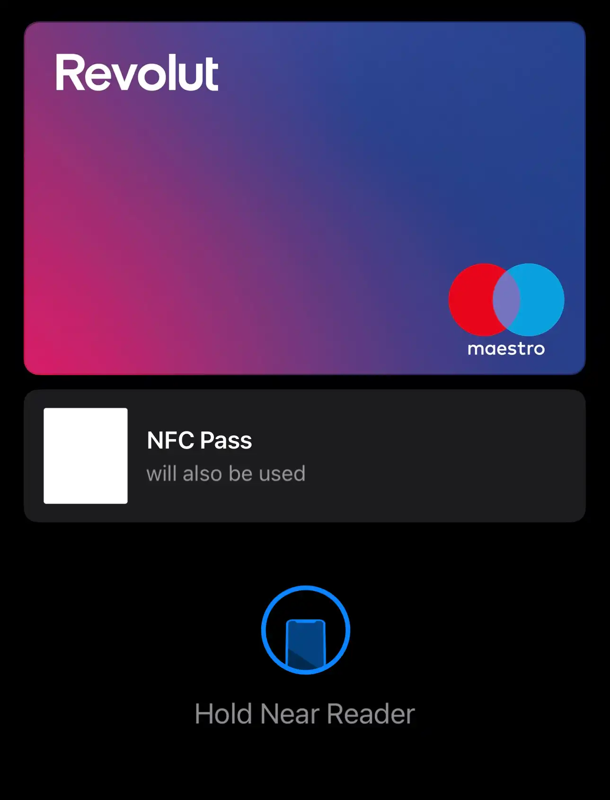
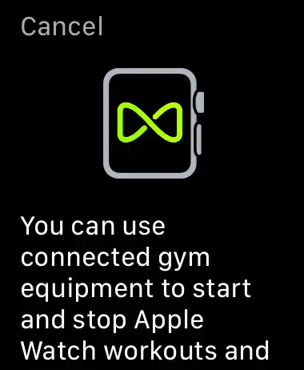
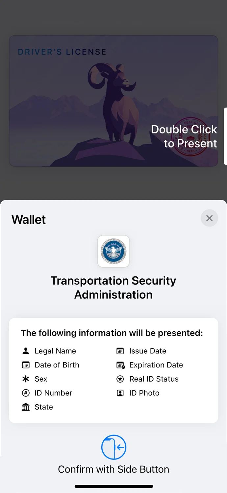
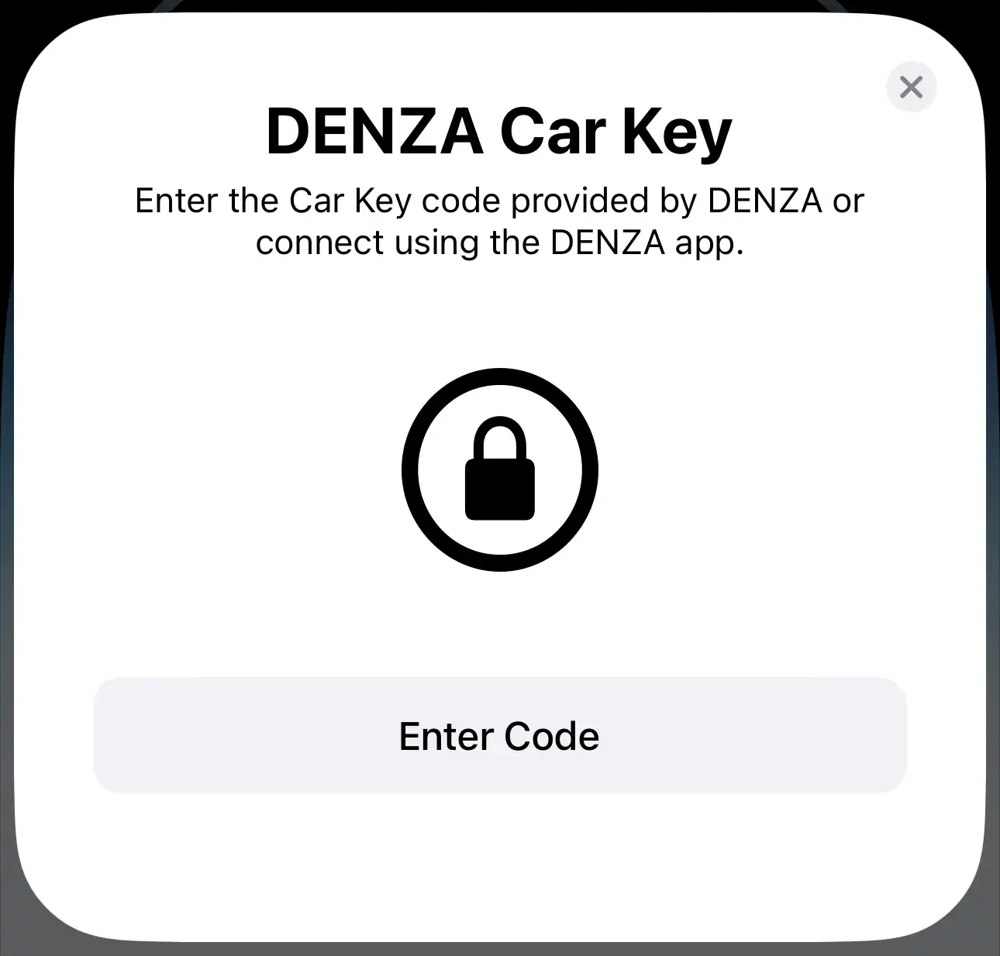
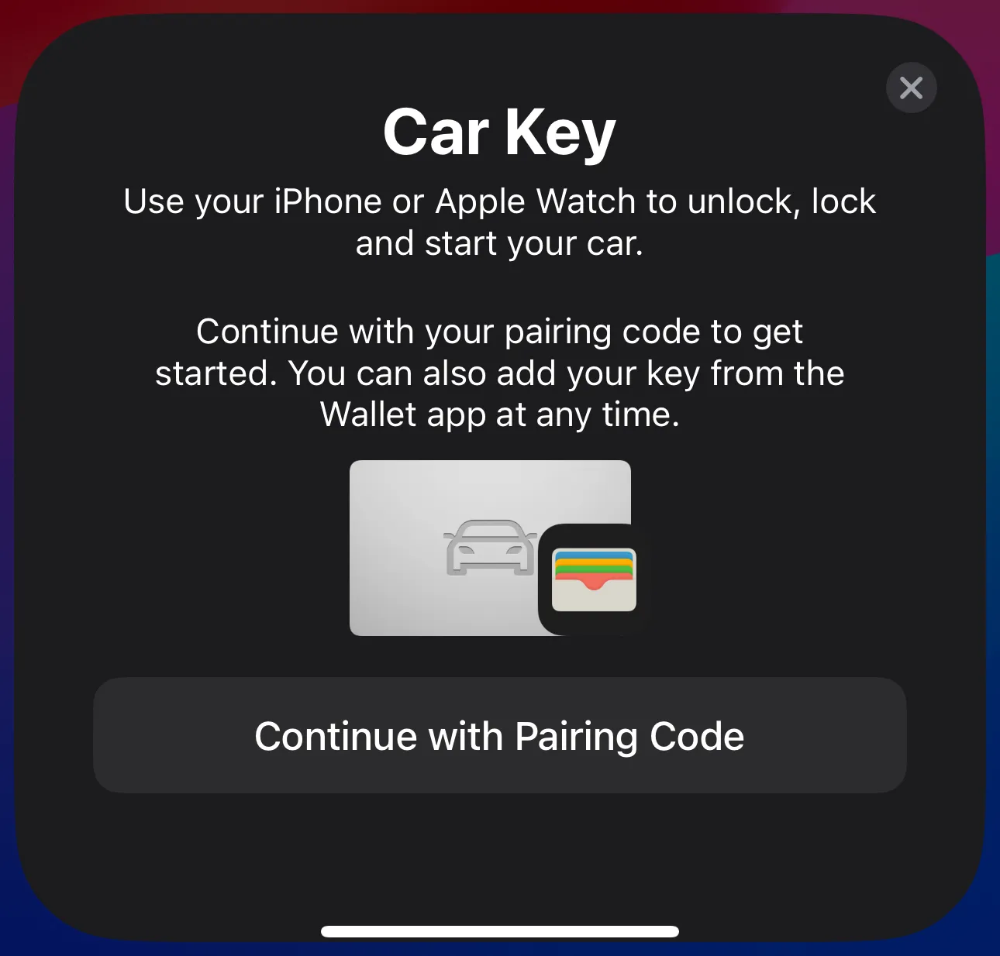
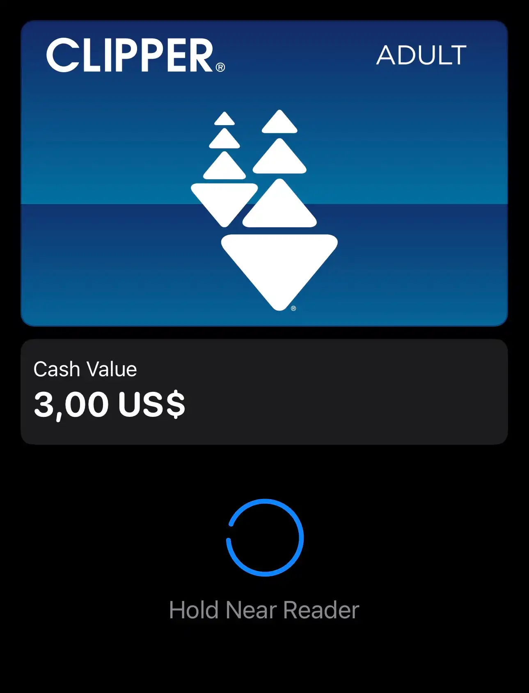

# Apple Enhanced Contactless Polling (ECP)

<p float="left">
 
 
</p>


Enhanced Contactless Polling/Protocol (ECP) is a proprietary extension to the ISO14443 (A/B) standard developed by Apple.   

It defines a custom data frame that a reader transmits during the polling sequence, giving an end device contextual info about the reader field, allowing it to select an appropriate applet even before any communication starts.  

This extension:
- Helps to make sure that end device will only start communication with the reader if it has something useful to do with it, avoiding error beeps and card clashing;
- Increases privacy and security as it complicates scanning for all available passes on the device in one tap.
- Allows automatic usage of non ISO7816-compliant passes:
  * DESFire in native mode and on card-level instead of app-level;
  * Passes without application id: Mifare Plus, Ultralight, Classic etc.
- Helps with conflict resolution when there are multiple passes with the same AID:
  * For instance, both Gymkit and ISO18013 use NDEF AID for BLE handover. ECP allows to differentiate between them in advance.


## Use cases


Express mode for most passes (apart from NFC-F and CATHAY) is implemented using ECP. That includes:
- Credit cards (For transit fallback);
- Transit cards;
- Access passes:
  - University;
  - Office badges;
  - Venue (Theme parks).
- Keys:
  - Car;
  - Home;
  - Apartment;
  - Hotel.

Other features use ECP as well:
- Value Added Services (VAS):  
  Allows reader to select the VAS applet and try to get pass in advance (although failing to do so), causing pass to appear on a screen for authentication or under a payment card if one is selected.  
  
  
  
- GymKit:  
  Makes apple watch act as an NDEF tag for BLE handover in order to connect to supported gym equipment.  
  
- Identity:
  Makes apple device act as an NDEF tag for BLE handover in order to connect to a ISO18013 verfier.  
  <p float="left">
   
  </p>
- CarKey Setup:  
  Tells the device what car brand it is, causing a car key setup popup to appear on a screen.  
  <p float="left">
   
   
  </p>
- Field ignore:  
  Makes apple devices not react (by react meaning displaying a default payment card) to a field generated by other apple devices.
- AirDrop:
  Replaces field ignore in IOS17 for background reading, used to negotiate an AirDrop session. NameDrop is a special case of AirDrop. Triggers a warp animation.  
  <p float="left">
   
  </p>
- HomeKit:  
  Allows appliances with an NFC reader that lack card emulation mode to convey pairing info and bring up a pairing prompt when a user device is brought near to it. 
  


## Device support


Reader side:
* Can be implemented in software on most devices, provided that a low-level access to NFC hardware is available. In some cases it is required to reimplement parts of the protocol stack in software when doing so. HALs/Libraries for most popular chips contain separate versions that inclue ECP support and are given to approved partners only, but homebrew solution is arbitrary to implement.  
  Proof of concept was successfuly tested using PN532, PN5180, ST25R3916(B) chips;
* IOS has special reader APIs that make the device emit specific ECP frames:
  *  NFCVASReaderSession, PaymentCardReaderSession for VAS;
  *  MobileDocumentReaderSession for Identity;
  *  When using other derivatives of NFCReaderSession, device emits Ignore frame so that other apple devices don't react to it.
* Android does not have an API for ECP, although some android-based handheld reader manufacturers have implemented this feature in their software.  
  
Device side:
* Implemented using a customized CRS applet.
* Can be implemented on chips that allow reading raw frames in emulation mode even before selection.


## Decision logic


Upon entering a loop, device does not answer to the first polling frame it sees, instead opting to wait and see what other technologies does the field poll for, allowing it to make a fully informed decision on what applet to select later.

When device makes a decision, it is mostly, although not in all cases (excluding keys) signified by a card image appearing along with a spinner.

Even though ECP is sent during the polling loop, device does not answer to it. Instead it responds to a polling frame related to technology of the pass that the device had decided to use.





When device enters the loop initially:
* In case of a full polling loop (A,B,F) it waits through one full iteration before making a decision on what applet to select:  
```
(ENTRY) -> A -> ECP_A -> B -> ECP_B -> F -> (DECISION) -> A -> (RESPONSE)
```

```
A -> ECP_A -> (ENTRY) -> B -> ECP_B -> F -> A -> ECP_A -> (DECISION) -> B -> (RESPONSE)
```


* In case of partial or wierdly-ordered polling loop, behavior is different. For example:

```
(ENTRY) -> A -> ECP_A -> A -> ECP_A -> (DECISION) -> A -> (RESPONSE)
```

```
(ENTRY) -> F -> B -> ECP_B -> A -> F -> B -> (DECISION) -> ECP_B -> A -> (RESPONSE)
```

```
(ENTRY) -> A -> ECP_B -> F -> A -> ECP_B -> (DECISION) -> F -> A -> (RESPONSE)
```

```
(ENTRY) -> F -> F -> F -> (DECISION) -> F -> (RESPONSE)
```

```
(ENTRY) -> A -> A -> A -> (DECISION)
```

```
(ENTRY) -> A -> ECP_A -> F -> A -> ECP_A -> F -> (DECISION) -> A -> (RESPONSE)
```

In conclusion, it seems that if reader is polling for:
* 1 technology, decision is made after third poll, response is given on the fourth;
* 2 technologies, decision is made after the second polling loop, while the response is given on the third.
* 3 technologies, decision is made after the first loop, response is given on the second.

Tests were conducted using very big intervals between polling frames. IRL if polling is faster device might respond after more frames than shown, presumably because of internal processing delay.  

Although not possible during normal operation, if a reader is polling for multiple cards using express mode that use different technology qualifiers for selection, following technology priority will be applied:
1. ECP 
2. NFC-F
3. CATHAY  
  
(BUG) If polling for both ECP and NFC-F, device will display NFC-F card in animation while actually selecting and emulating NFC-A/NFC-B applet. 

(NOTE) In IOS17 new AirDrop frame does not follow the beforementioned rules, as device reacts to it on first iteration in all cases.


## Structure

### Frame format

Each ECP frame consists of a header, version, payload and CRC:

```
     6A         XX          XX...     XX XX
  [Header]  [Version]  [Payload (n)]  [CRC]
```
- Header byte has a constant value of (HEX) 6A;
- Version number can be either 0x01 or 0x02;
- Payload: Version-dependant;
- CRC (Calculated via ISO14443A/B algorithm, according to the modulation used).

### Payload

For V1 payload consists only of a single TCI:  
  ```
    XX XX XX
     [TCI]  
  ```
- TCI is a 3 byte long identifier
  

For V2 payload contains terminal configuration, terminal type, terminal subtype, and data:  
  ```
       XX       XX        XX         XX...
    [Config]  [Type]  [Subtype]  [Data (n)]
  ```
  - Configuration byte has a following binary format:  
  ```
        1        X        0 0      X X X X
    [Unknown]  [Auth]  [Unknown]  [Length ]  
  ```  
    * Auth: 0b1 if authentication not required, 0b0 otherwise.  
      If auth is required pass will be presented on a screen for manual authentication when brought near to the field.
    * Length: defines a length of extra data.
  - Type contains terminal type:
    - 0x01: Transit;
    - 0x02: Access;
    - 0x03: Identity (Handoff);
    - 0x05: AirDrop.
  - Subtype depends on type. In most cases it has a value of 0x00;
  - Data. Its content and availability depend on terminal type and subtype:
  ```
    XX XX XX...        XX..
    [TCIs (n)]   [Extra data (n)]
  ``` 
  - TCIs defines an array of 3 byte long indentifiers. Standard allows for 0-n long TCI arrays to be conveyed depending on terminal type and subtype, but in practice exactly one is used always;
  - Extra data contents depend on terminal type, subtype, and TCIs:
    * For access/key readers it may contain a 8 byte long unique reader group identifier, which allows to differentiate between them for passes of the same type;
    * For HomeKit it contains pairing information;
    * For NameDrop it carries a 6 byte long BLE MAC address;
    * For AirDrop it carries a 6 byte long zeroed out value.

### TCI

TCI, also referred to as Terminal Capabilities Identifier, is an arbitrary three-byte-long value that establishes reader relation to a particular pass type (Home key, Car key, Transit) or system feature (Ignore, GymKit, AirDrop, NameDrop).

The following restrictions apply to the use of TCI:
- Some TCIs are bound to a reader with particular type and subtype (which requires V2), while others trigger for all types (support V1). It is not known if this behavior is a bug or was intentional.  
- TCIs intended for V1 cannot be used with V2.

TCI format is arbitrary, although several patterns related to grouping of similar functionality can be established:
- VAS: grouped with the last byte having a value of 0x00, 0x01, 0x02, 0x03 depending on mode.
- Access (Car/Home/University/Office/Venue): First byte is static, other two link to a particular pass provider.
- Transit: First byte is static, other two link to a particular transit agency (and their pass).
- CarKey: usually grouped by car manufacturer, consequent values signal readers on front/back doors,charging pad, etc. First byte is always 0x01. Can be seen in wallet configuration json hosted at [smp-device-content.apple.com](https://smp-device-content.apple.com/static/region/v2/config.json).


**More information coming soon©.**


## Notes

- Although the document describes things in an imperative/declarative way, information was obtained in a experimental way without access to closed resources. Therefore some information might be wrong/misleading or only written as an assumption.
- If you find any mistakes or have extra information, feel free to raise an issue or create a pull request.


## References

* Documents and websites that contain info that helped with research:
  - [IOS16 Runtime Headers](https://developer.limneos.net/?ios=16.3);
  - [Apple Developer Documentation](https://developer.apple.com/documentation/);
  - Chip brochures (with ECP mentions):
    - [PN7150X](https://www.nxp.com/docs/en/brochure/PN7150X_LF.pdf) [(Archive)](https://web.archive.org/web/20210920054718/https://www.nxp.com/docs/en/brochure/PN7150X_LF.pdf);
    - [ST25](https://www.st.com/resource/en/product_presentation/st25_product_overview.pdf) [(Archive)](https://web.archive.org/web/20230109135439/https://www.st.com/content/ccc/resource/sales_and_marketing/presentation/product_presentation/group1/a9/5d/77/96/be/9a/48/7e/ST25_NFC_RFID_product_overview/files/ST25_product_overview.pdf/jcr:content/translations/en.ST25_product_overview.pdf).
  - Chip datasheets:
    - [PN532](https://www.nxp.com/docs/en/nxp/data-sheets/PN532_C1.pdf) [(Archive)](https://web.archive.org/web/20230401225452/https://www.nxp.com/docs/en/nxp/data-sheets/PN532_C1.pdf);
    - [PN5180](https://www.nxp.com/docs/en/data-sheet/PN5180A0XX-C1-C2.pdf) [(Archive)](https://web.archive.org/web/20221127182441/http://www.nxp.com/docs/en/data-sheet/PN5180A0XX-C1-C2.pdf);
    - [ST25R3916](https://www.st.com/resource/en/datasheet/st25r3916.pdf) [(Archive)](https://web.archive.org/web/20230124020718/https://www.st.com/resource/en/datasheet/st25r3916.pdf).
* Devices and software used for analysis:
  - Proxmark3 Easy was used to sniff out ECP frames (No link, can be bought at AliExpress, DangerousThings), Proxmark3 RDV2/R can also be used;
  - [Proxmark3 Iceman Fork](https://github.com/RfidResearchGroup/proxmark3) - firmware for Proxmark3.
  - PN532, PN5180, ST25R3916 - chips used to test homebrew ECP reader implementation.


