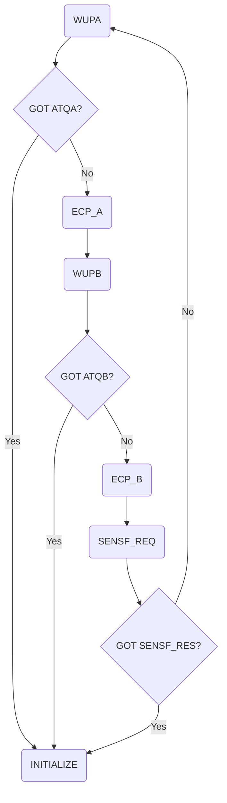

# Apple Enchanced Contactless Polling (ECP)


Enhanced Contactless Polling/Protocol (ECP) is a proprietary extension to the ISO14443 (A/B) standard developed by Apple.   

It defines a custom data frame that a reader transmits during the polling sequence, giving an end device contextual info about the reader field, allowing it to select an appropriate applet even before any communication starts.  

This extension:
- Helps to make sure that end device will only start communication with the reader if it has something useful to do with it, avoiding error beeps and card clashing;
- Allows automatic usage of non ISO7816-compliant passes:
  * DESFire in native mode or on card-level instead of app-level;
  * (Theoretically) Passes without application id: Mifare Plus, Ultralight etc.
- Helps with conflict resolution when there are multiple passes with the same AID:
  * For instance, both Gymkit and ISO18013 use NDEF AID for BLE handover. ECP allows to differentiate between them in advance.


## Use cases


Express mode for most passes (apart from NFC-F and CATHAY) is implemented using ECP. That includes:
- Credit cards (For transit fallback);
- Transit cards;
- Access passes:
  - University;
  - Office badges;
  - Venue (Theme parks).
- Keys:
  - Car;
  - Home;
  - Apartment;
  - Hotel.

Other features use ECP as well:
- Value Added Services (VAS):  
  Allows reader to select the VAS applet and try to get pass in advance (although failing to do so), causing pass to appear on a screen for authentication or under a payment card if one is selected.
- GymKit:  
  Makes apple watch act as an NDEF tag for BLE handover in order to connect to supported gym equipment.
- CarKey Setup:  
  Tells the device what car brand it is, causing a car key setup popup to appear on a screen.
- Field ignore:  
  Makes apple devices not react (by react meaning displaying a default payment card) to a field generated by other apple devices.
- Homekit pairing:
  Allows devices with an nfc reader lacking card emulation mode to display pairing promt when device is brought near to it. 


## Device support


Reader side:
* Can be impleneted in software on many  devices, provided that a low-level access to NFC hardware is available.  
  Proof of concept was successfuly tested using PN532, PN5180, ST25R3916 chips;
* IOS has special reader APIs that make the device emit specific ECP frames (E.g. NFCVASReaderSession for VAS). When polling for NDEF tags in background or using other derivatives of NFCReaderSession, device emits IGNORE frame so that other apple devices don't react to it.
* Android does not have an API for ECP, although some android-based handheld reader manufacturers have implemented this feature in their hardware.  
  
Device side:
* Implemented using a customized CRS applet.


## Communication flow


ECP-equiped readers operate in a following polling loop:



ECP frame can be sent using either A or B modulation. Diagram shows a scenario when reader polls for A, B, F cards, although any part of it can be skipped.


## Decision logic


Upon entering a loop, device does not answer to the first polling frame it sees, instead opting to wait and see what other technologies does the field poll for, allowing it to make a fully informed decision on what applet to select later.


When devices makes a decision, it is mostly, although not in all cases (excluding keys) signified by a card image appearing along with a spinner.


When device enters the loop initially:
* In case of a full polling loop (A,B,F) it waits through one full iteration before making a decision on what applet to select:  
```
(ENTRY) -> A -> ECP_A -> B -> ECP_B -> F -> (DECISION) -> A -> (RESPONSE)
```

```
A -> ECP_A -> (ENTRY) -> B -> ECP_B -> F -> A -> ECP_A -> (DECISION) -> B -> (RESPONSE)
```


* In case of partial or wierdly-ordered polling loop, behavior is different. For example:

```
(ENTRY) -> A -> ECP_A -> A -> ECP_A -> (DECISION) -> A -> (RESPONSE)
```

```
(ENTRY) -> F -> B -> ECP_B -> A -> F -> B -> (DECISION) -> ECP_B -> A -> (RESPONSE)
```

```
(ENTRY) -> A -> ECP_B -> F -> A -> ECP_B -> (DECISION) -> F -> A -> (RESPONSE)
```

```
(ENTRY) -> F -> F -> F -> (DECISION) -> F -> (RESPONSE)
```

```
(ENTRY) -> A -> A -> A -> (DECISION)
```

```
(ENTRY) -> A -> ECP_A -> F -> A -> ECP_A -> F -> (DECISION) -> A -> (RESPONSE)
```

In conclusion, it seems that if reader is polling for:
* 1 technology, decision is made after third poll, response is given on the fourth;
* 2 technologies, decision is made after the second polling loop, while the response is given on the third.
* 3 technologies, decision is made after the first loop, response is given on the second.

Tests were conducted using very big intervals between polling frames. IRL if polling is faster device might respond after more frames than shown, probably because of internal processing delay.  

Although probably not possible during normal operation, if a reader is polling for multiple cards using express mode that use different technology qualifiers for selection, following technology priority will be applied:
1. ECP 
2. NFC-F
3. CATHAY  
  
(BUG) If polling for both ECP and NFC-F, device will display NFC-F card in animation while actually selecting and emulating NFC-A/NFC-B applet. 


## Structure


Each ECP frame consists of a header, version, data part and CRC:

```
     6A         XX        XX...    XX XX
  [Header]  [Version]  [Data (n)]  [CRC]
```
- Header byte has a constant value of (HEX) 6A;
- Version number can be either 1 or 2;
- Data part: REDACTED;
- CRC (Calculated via ISO14443A/B algorithm, according to the modulation used).


More info coming soon©.